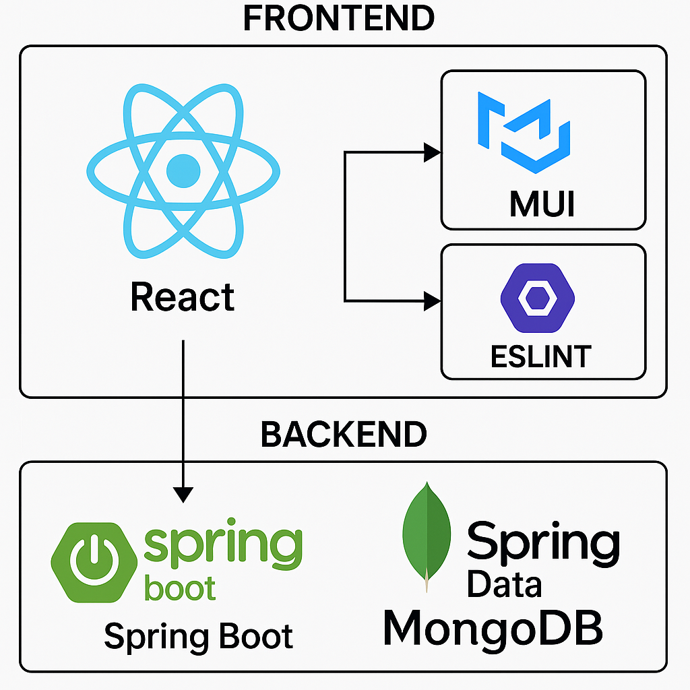

# OpenLab in Learning Analytics

## Overview

is a research-driven approach that emphasizes openness, transparency, and inclusivity. It goes beyond traditional analytics by focusing on collaboration, co-design, and interoperability across educational environments.

---

## Core Principles of Open Learning Analytics (OLA)

Open Learning Analytics is structured around four key dimensions:

1. **What?** – Data, environment, and context.
2. **Who?** – Stakeholders involved (learners, educators, institutions).
3. **Why?** – Objectives and purposes of analytics.
4. **How?** – Methods, models, and techniques applied.

These principles aim to foster **lifelong learning environments** and transparent, reusable, and collaboratively-developed analytics solutions.

# Architecture 

## Backend
1. **Spring Boot:** Main framework for building the backend REST API, dependency injection, and application configuration.
2. **Spring Data MongoDB:** For data persistence with MongoDB.
3. **JWT (java-jwt):** For authentication and authorization.
4. **JUnit:** For unit testing.

## Frontend
1. **React:** Main library for building the user interface.
2. **MUI (Material-UI):** For UI components and icons.
3. **ESLint:** For code linting and style enforcement.

# Group Members
* Muthna Jasim (ISE CE)
* Karim Emara (ISE CE)
* Ali Abdul Nabi (WI M)
* Salma Sbaghi (Komedia B)
* Medina Lekiqi (Komedia B)
* Fatima Sharaf (AI B)
* Luca Zemek (AI M)

# ScreenShots
[**📷Screenshots of Features and Fixes**](./Screenshots.pdf)

# Live demo video

TODO
